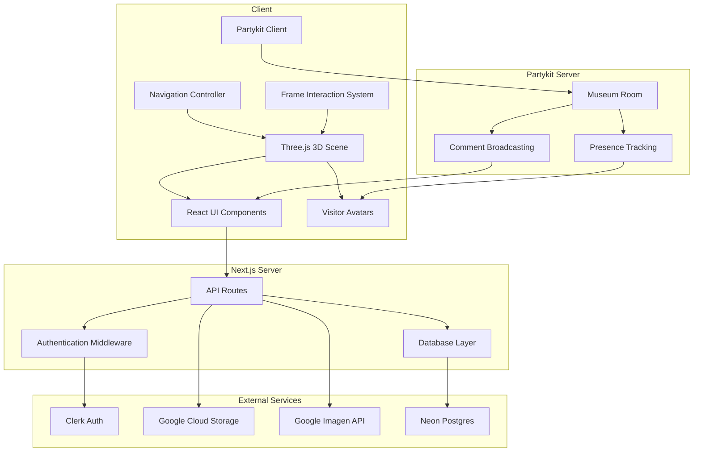

# Design Document

## Overview

The 3D Museum Platform is a full-stack web application combining Three.js for immersive 3D rendering with Next.js for server-side rendering and API routes. The architecture follows a client-server model where the Next.js backend handles authentication, database operations, and external API integrations, while the Three.js frontend manages 3D scene rendering, user interactions, and real-time navigation.

The system is designed for optimal performance on mobile devices (targeting iPhone 12 as baseline) through aggressive optimization strategies including texture compression, lazy loading, level-of-detail rendering, and adaptive quality settings.

## Architecture

### High-Level Architecture



### Technology Stack

- **Frontend Framework**: Next.js 16+ (App Router)
- **3D Rendering**: Three.js with React Three Fiber
- **API Layer**: tRPC for end-to-end type-safe APIs
- **Data Fetching**: TanStack Query (React Query) for caching and state management
- **Authentication**: Clerk with Google OAuth provider
- **Database**: Neon Postgres (serverless)
- **ORM**: Drizzle ORM
- **Real-time Multiplayer**: Partykit for presence and live updates
- **Image Storage**: Google Cloud Storage
- **AI Image Generation**: Google Imagen API
- **State Management**: Zustand for global 3D/UI state
- **Styling**: Tailwind CSS for UI components
- **Mobile Controls**: React Joystick Component

### Deployment Architecture

- **Hosting**: Vercel (Next.js optimized)
- **Database**: Neon Postgres (serverless, auto-scaling)
- **CDN**: Vercel Edge Network for static assets
- **Image Delivery**: Google Cloud Storage with CDN

## Components and Interfaces

### Frontend Components

#### 1. Museum Scene Manager

**Responsibility**: Orchestrates the entire 3D scene, lighting, and camera

**Key Features**:

- Initializes Three.js scene with optimized renderer settings
- Manages day/night theme lighting configurations
- Handles scene transitions between museums
- Implements frustum culling and occlusion

**Performance Optimizations**:

- Use `WebGLRenderer` with `powerPreference: "high-performance"`
- Enable `antialias: false` on mobile devices
- Set `pixelRatio` to `Math.min(window.devicePixelRatio, 2)`

#### 2. Museum Layout Generator

**Responsibility**: Procedurally generates museum geometry based on frame count

**Key Features**:

- Creates Main Hall with 9 frame positions
- Dynamically extends Extendable Hall with alternating left-right pattern
- Places portal at the end of the hall
- Generates collision boundaries for navigation

**Layout Algorithm**:

```
Main Hall: 3x3 grid of frames on back wall
Extendable Hall:
  - Start with 1 empty frame on left wall
  - When filled, add frame on opposite wall, extend corridor
  - Alternate: left → right → left → right
  - Max 21 frames in extendable hall (30 total - 9 main hall)
```

#### 3. Frame Entity Component

**Responsibility**: Renders individual picture frames with images and interactions

**Key Features**:

- Lazy loads textures when camera is within 15 units
- Displays hover indicators (circle for empty, highlight for filled)
- Raycasting for click detection
- LOD system: high-res within 10 units, low-res beyond

**Texture Optimization**:

- Compress images to WebP format
- Generate mipmaps for smooth scaling
- Max texture size: 2048x2048
- Use `THREE.LinearFilter` for minification

#### 4. Navigation Controller

**Responsibility**: Handles user input for movement and camera control

**Desktop Controls**:

- WASD for movement (PointerLockControls)
- Mouse for camera rotation
- Collision detection with walls
- Movement speed: 5 units/second

**Mobile Controls**:

- Virtual joystick for movement (bottom-left)
- Touch drag for camera rotation
- Pinch-to-zoom disabled
- Movement speed: 3 units/second (slower for precision)

#### 5. Frame Interaction Modal

**Responsibility**: UI overlay for frame management

**States**:

- **Empty Frame**: Upload button, Camera capture button, AI Generate section (prompt input + style dropdown)
- **Filled Frame**: View Details, Edit, Delete, Share buttons

**Modal Behavior**:

- Pauses 3D navigation when open
- Closes on ESC key or outside click
- Smooth fade-in/out animations

#### 6. Profile Overlay

**Responsibility**: User profile and museum management UI

**Features**:

- User profile picture (from Google)
- Current museum name
- Public/Private toggle with Share Link generation
- "Create New Museum" button
- List of user's museums

#### 7. Portal System

**Responsibility**: Museum switching interface

**Behavior**:

- Triggers when user walks into portal collision zone
- Displays museum selection UI
- Smooth fade-to-black transition
- Loads new museum scene
- Spawns user at entrance of new museum

#### 8. Tutorial Modal

**Responsibility**: First-time user onboarding

**Content**:

- Welcome message
- Navigation instructions (WASD/joystick)
- Frame interaction guide
- AI generation overview
- Dismiss button

**Persistence**: Store dismissal in localStorage and database

#### 9. Visitor Avatar Component

**Responsibility**: Renders 3D representations of other visitors in the museum

**Key Features**:

- Simple 3D mesh (capsule or humanoid shape) with color variation
- Displays visitor name label above avatar
- Smooth position interpolation for movement
- Rotation to face movement direction
- LOD: simplified mesh for distant avatars

**Performance**:

- Instanced rendering for multiple avatars
- Limit to 50 concurrent avatars
- Cull avatars outside camera frustum

#### 10. Partykit Presence Manager

**Responsibility**: Manages real-time multiplayer presence and synchronization

**Key Features**:

- Connects to Partykit room on museum entry
- Broadcasts position/rotation at 10Hz (100ms intervals)
- Receives and processes other visitors' updates
- Handles visitor join/leave events
- Maintains visitor count

**Message Types**:

```typescript
// Outgoing
type PositionUpdate = {
  type: "position";
  x: number;
  y: number;
  z: number;
  rotationY: number;
  userId?: string;
  userName: string;
};

// Incoming
type VisitorJoined = {
  type: "join";
  visitorId: string;
  userName: string;
  position: { x: number; y: number; z: number };
};

type VisitorLeft = {
  type: "leave";
  visitorId: string;
};
```

#### 11. Comment Thread Component

**Responsibility**: Displays and manages comments on frame images

**Key Features**:

- Scrollable list of comments with timestamps
- Real-time updates via Partykit
- Text input for new comments
- Delete button for museum owners
- Character counter (500 max)
- Optimistic UI updates

**Display Format**:

- Profile picture (if authenticated user)
- Name or "Anonymous Visitor"
- Comment text
- Relative timestamp ("2 minutes ago")
- Delete button (conditional)

### tRPC API Router Structure

**Authentication Routes** (`auth` router):

- `auth.callback` - Clerk webhook for user creation (mutation)
- `auth.session` - Get current user session (query)

**Museum Routes** (`museum` router):

- `museum.list` - List user's museums (query)
- `museum.create` - Create new museum (mutation)
- `museum.getById` - Get museum details by ID (query)
- `museum.update` - Update museum name and public status (mutation)
- `museum.delete` - Delete museum (mutation)
- `museum.generateShareLink` - Generate unique share token (mutation)

**Frame Routes** (`frame` router):

- `frame.listByMuseum` - List all frames in a museum (query)
- `frame.create` - Create or update frame with image (mutation)
- `frame.delete` - Remove frame image (mutation)
- `frame.generateShareLink` - Generate frame-specific share token (mutation)

**Image Routes** (`image` router):

- `image.upload` - Upload image to Google Cloud Storage (mutation)
- `image.generate` - Generate image with Google Imagen (mutation)
- `image.getSignedUrl` - Get signed URL for image (query)

**Public Routes** (`public` router - no auth required):

- `public.getMuseumByShareToken` - Get public museum data (query)
- `public.getFrameByShareToken` - Get frame data with spawn position (query)

**Comment Routes** (`comment` router):

- `comment.listByFrame` - Get all comments for a frame (query)
- `comment.create` - Create new comment, auth optional (mutation)
- `comment.delete` - Delete comment, owner only (mutation)

**tRPC Client Usage Examples**:

```typescript
// Query with React Query
const { data: museums } = trpc.museum.list.useQuery();

// Mutation with optimistic updates
const createMuseum = trpc.museum.create.useMutation({
  onSuccess: () => {
    utils.museum.list.invalidate();
  },
});

// Public access (no auth)
const { data: museum } = trpc.public.getMuseumByShareToken.useQuery({
  shareToken,
});
```

### Partykit Server

**Museum Room** (`/party/museum/[museumId]`)

Handles real-time presence and comment broadcasting for a specific museum.

**Connection Lifecycle**:

1. Client connects with museum ID
2. Server adds visitor to presence map
3. Server broadcasts join event to all clients
4. Client sends position updates every 100ms
5. Server relays position updates to other clients
6. On disconnect, server broadcasts leave event

**Message Handlers**:

- `position`: Update visitor position, broadcast to others
- `comment`: Broadcast new comment to all visitors
- `comment_delete`: Broadcast comment deletion to all visitors

**State Management**:

- In-memory map of connected visitors
- Visitor metadata (ID, name, last position)
- Automatic cleanup on disconnect

## Data Models

### Database Schema

```typescript
// schema.ts using Drizzle ORM
import {
  pgTable,
  text,
  timestamp,
  boolean,
  integer,
  jsonb,
  unique,
  index,
} from "drizzle-orm/pg-core";
import { createId } from "@paralleldrive/cuid2";

export const users = pgTable("users", {
  id: text("id")
    .primaryKey()
    .$defaultFn(() => createId()),
  clerkId: text("clerk_id").notNull().unique(),
  email: text("email").notNull().unique(),
  profilePicUrl: text("profile_pic_url"),
  createdAt: timestamp("created_at").defaultNow().notNull(),
  updatedAt: timestamp("updated_at").defaultNow().notNull(),
});

export const museums = pgTable(
  "museums",
  {
    id: text("id")
      .primaryKey()
      .$defaultFn(() => createId()),
    userId: text("user_id")
      .notNull()
      .references(() => users.id, { onDelete: "cascade" }),
    name: text("name").notNull().default("My Museum"),
    isPublic: boolean("is_public").notNull().default(false),
    shareToken: text("share_token").unique(),
    themeMode: text("theme_mode").notNull().default("day"), // "day" or "night"
    createdAt: timestamp("created_at").defaultNow().notNull(),
    updatedAt: timestamp("updated_at").defaultNow().notNull(),
  },
  (table) => ({
    userIdIdx: index("museums_user_id_idx").on(table.userId),
    shareTokenIdx: index("museums_share_token_idx").on(table.shareToken),
  })
);

export const frames = pgTable(
  "frames",
  {
    id: text("id")
      .primaryKey()
      .$defaultFn(() => createId()),
    museumId: text("museum_id")
      .notNull()
      .references(() => museums.id, { onDelete: "cascade" }),
    position: integer("position").notNull(), // 0-8 for main hall, 9+ for extendable hall
    side: text("side"), // "left" or "right" for extendable hall frames
    imageUrl: text("image_url"),
    description: text("description"),
    themeColors: jsonb("theme_colors"), // Array of hex colors extracted from image
    shareToken: text("share_token").unique(),
    createdAt: timestamp("created_at").defaultNow().notNull(),
    updatedAt: timestamp("updated_at").defaultNow().notNull(),
  },
  (table) => ({
    museumIdIdx: index("frames_museum_id_idx").on(table.museumId),
    shareTokenIdx: index("frames_share_token_idx").on(table.shareToken),
    museumPositionUnique: unique("frames_museum_position_unique").on(
      table.museumId,
      table.position
    ),
  })
);

export const comments = pgTable(
  "comments",
  {
    id: text("id")
      .primaryKey()
      .$defaultFn(() => createId()),
    frameId: text("frame_id")
      .notNull()
      .references(() => frames.id, { onDelete: "cascade" }),
    userId: text("user_id").references(() => users.id, {
      onDelete: "set null",
    }), // Nullable for guest comments
    authorName: text("author_name").notNull(), // "Anonymous Visitor" or user name
    authorProfilePic: text("author_profile_pic"), // Null for guests
    content: text("content").notNull(), // Max 500 chars validated in app
    createdAt: timestamp("created_at").defaultNow().notNull(),
  },
  (table) => ({
    frameIdIdx: index("comments_frame_id_idx").on(table.frameId),
    userIdIdx: index("comments_user_id_idx").on(table.userId),
    createdAtIdx: index("comments_created_at_idx").on(table.createdAt),
  })
);
```

### Client-Side State Management (Zustand)

```typescript
interface MuseumStore {
  // Current museum data
  currentMuseum: Museum | null;
  frames: Frame[];

  // UI state
  isLoading: boolean;
  selectedFrame: Frame | null;
  showProfileOverlay: boolean;
  showTutorial: boolean;
  themeMode: "day" | "night";

  // Multiplayer state
  visitors: Map<string, Visitor>; // visitorId -> Visitor
  visitorCount: number;

  // Actions
  setCurrentMuseum: (museum: Museum) => void;
  updateFrame: (frame: Frame) => void;
  deleteFrame: (frameId: string) => void;
  toggleTheme: () => void;
  setSelectedFrame: (frame: Frame | null) => void;
  addVisitor: (visitor: Visitor) => void;
  updateVisitor: (
    visitorId: string,
    position: Vector3,
    rotation: number
  ) => void;
  removeVisitor: (visitorId: string) => void;
  setVisitorCount: (count: number) => void;
}

interface Visitor {
  id: string;
  name: string;
  position: { x: number; y: number; z: number };
  rotationY: number;
  lastUpdate: number;
}
```

## Error Handling

### Client-Side Error Handling

1. **Network Errors**

   - Display toast notification with retry option
   - Cache failed requests for retry when connection restored
   - Graceful degradation: show placeholder images

2. **3D Rendering Errors**

   - Fallback to lower quality settings
   - Error boundary component to catch React errors
   - Log errors to monitoring service (e.g., Sentry)

3. **Authentication Errors**

   - Redirect to sign-in page
   - Clear invalid tokens
   - Show user-friendly error messages

4. **Image Upload Errors**
   - Validate file size (max 10MB) before upload
   - Validate file type (JPEG, PNG, WebP)
   - Show progress indicator
   - Handle timeout after 30 seconds

### Server-Side Error Handling

1. **API Route Error Responses**

```typescript
// Standardized error response format
{
  error: {
    code: "UNAUTHORIZED" | "NOT_FOUND" | "VALIDATION_ERROR" | "SERVER_ERROR",
    message: "Human-readable error message",
    details?: any
  }
}
```

2. **Database Errors**

   - Wrap all database operations in try-catch
   - Log errors with context
   - Return generic error to client (don't expose DB details)
   - Implement retry logic for transient failures

3. **External API Errors**

   - **Google Cloud Storage**: Retry up to 3 times with exponential backoff
   - **Google Imagen**: Handle rate limits, queue requests if needed
   - **Clerk**: Validate webhooks, handle auth failures gracefully

4. **Validation Errors**

   - Use Zod for request validation
   - Return 400 status with detailed validation errors
   - Validate on both client and server

5. **Partykit Connection Errors**
   - Implement automatic reconnection with exponential backoff
   - Show connection status indicator to user
   - Queue position updates during disconnection
   - Gracefully degrade: hide other visitors if connection fails

## Performance Optimization Strategy

### 3D Rendering Optimizations

1. **Geometry Optimization**

   - Use instanced meshes for repeated elements (frames)
   - Merge static geometries where possible
   - Use simple box colliders instead of mesh colliders

2. **Texture Management**

   - Lazy load textures based on camera distance
   - Unload textures when user moves far away
   - Use texture atlases for UI elements
   - Compress textures to WebP or Basis Universal format

3. **Level of Detail (LOD)**

   - High-res frames: < 10 units from camera
   - Medium-res frames: 10-20 units
   - Low-res frames: > 20 units
   - Disable shadows for distant objects

4. **Rendering Pipeline**

   - Enable frustum culling
   - Use occlusion culling for frames behind walls
   - Limit shadow map resolution on mobile
   - Use baked lighting where possible

5. **Frame Rate Management**
   - Target 60fps on desktop, 60fps on iPhone 12
   - Adaptive quality: reduce settings if FPS drops below 50
   - Use `requestAnimationFrame` for smooth animations
   - Throttle raycasting to every 100ms

### Network Optimizations

1. **Image Delivery**

   - Serve images via CDN
   - Generate multiple sizes (thumbnail, medium, full)
   - Use progressive JPEG for faster perceived loading
   - Implement image preloading for adjacent frames

2. **API Response Caching**

   - React Query automatically caches tRPC responses
   - Configure stale time for museum/frame data (5 minutes)
   - Implement optimistic updates for mutations
   - Use React Query devtools for debugging cache

3. **Code Splitting**
   - Lazy load Three.js components
   - Split AI generation UI into separate chunk
   - Use dynamic imports for heavy libraries

### Mobile-Specific Optimizations

1. **Touch Performance**

   - Use passive event listeners
   - Debounce touch events
   - Reduce touch target complexity

2. **Memory Management**

   - Limit max textures in memory (20 at a time)
   - Dispose of Three.js objects properly
   - Monitor memory usage, trigger cleanup if needed

3. **Battery Optimization**
   - Reduce frame rate when tab is inactive
   - Lower rendering quality on low battery
   - Disable expensive effects on mobile

## Testing Strategy

### Unit Tests

**Backend (Jest)**:

- tRPC router procedures
- Database query functions
- tRPC middleware (authentication, rate limiting)
- Image upload/generation logic
- Share link generation

**Frontend (Jest + React Testing Library)**:

- UI components (modals, overlays)
- State management (Zustand stores)
- Utility functions
- Form validation

### Integration Tests

**tRPC Integration**:

- Full tRPC workflows (create museum → add frames → share)
- Authentication flows with tRPC context
- Public router access scenarios
- Error handling and validation with Zod schemas

**Database Integration**:

- Drizzle migrations
- Complex queries
- Cascade deletes
- Unique constraints

### End-to-End Tests (Playwright)

**Critical User Flows**:

1. Sign in → Create museum → Upload image → View in 3D
2. Generate AI image → Add to frame → Share museum
3. Access shared museum as guest → Navigate → View frames
4. Create multiple museums → Switch via portal
5. Mobile navigation and interaction

**Performance Tests**:

- Measure FPS on target devices
- Test with 30 frames loaded
- Measure initial load time
- Test image loading performance

### Manual Testing Checklist

**Desktop**:

- [ ] WASD navigation smooth
- [ ] Mouse look responsive
- [ ] Frame hover indicators appear
- [ ] Modal interactions work
- [ ] Theme toggle changes lighting
- [ ] Portal transitions smooth

**Mobile (iPhone 12)**:

- [ ] Touch joystick responsive
- [ ] Camera rotation smooth
- [ ] 60fps maintained
- [ ] Image upload from camera works
- [ ] UI elements properly sized
- [ ] No layout shifts

**Cross-Browser**:

- [ ] Chrome/Edge (Chromium)
- [ ] Safari (WebKit)
- [ ] Firefox
- [ ] Mobile Safari
- [ ] Mobile Chrome

### Performance Benchmarks

**Target Metrics**:

- Initial page load: < 3 seconds
- Time to interactive: < 5 seconds
- Frame rate: 60fps (desktop), 60fps (iPhone 12)
- Image upload: < 5 seconds for 5MB file
- AI generation: < 10 seconds
- Museum transition: < 2 seconds

## Security Considerations

1. **Authentication**

   - All museum modification routes require authentication
   - Validate user owns museum before allowing edits
   - Use Clerk middleware for route protection

2. **Image Upload**

   - Validate file types and sizes
   - Scan for malicious content
   - Generate unique filenames to prevent overwrites
   - Use signed URLs with expiration

3. **Public Access**

   - Share tokens are cryptographically random (cuid)
   - Public museums are read-only for guests
   - Rate limit public endpoints

4. **Data Privacy**

   - Users can only see their own museums
   - Public museums don't expose owner email
   - Soft delete for museums (retain for 30 days)

5. **Multiplayer Security**

   - Validate museum access before allowing Partykit connection
   - Rate limit position updates (max 10/second per visitor)
   - Sanitize visitor names to prevent XSS
   - Limit comment length and rate (max 1 comment per 5 seconds)

6. **Comment Moderation**
   - Only museum owners can delete comments
   - Validate ownership before allowing deletion
   - Log all comment deletions for audit trail

## Deployment Strategy

1. **Environment Variables**

```
DATABASE_URL=
NEXT_PUBLIC_CLERK_PUBLISHABLE_KEY=
CLERK_SECRET_KEY=
GOOGLE_CLOUD_STORAGE_BUCKET=
GOOGLE_CLOUD_CREDENTIALS=
GOOGLE_IMAGEN_API_KEY=
NEXT_PUBLIC_PARTYKIT_HOST=
PARTYKIT_SECRET=
NEXT_PUBLIC_TRPC_URL=
```

2. **Database Migrations**

   - Run Drizzle migrations on deploy using drizzle-kit
   - Use Neon branching for staging environment

3. **Monitoring**

   - Vercel Analytics for performance
   - Sentry for error tracking
   - Custom logging for 3D performance metrics

4. **Rollback Plan**
   - Use Vercel instant rollback
   - Database migrations are reversible
   - Keep previous image versions in GCS
